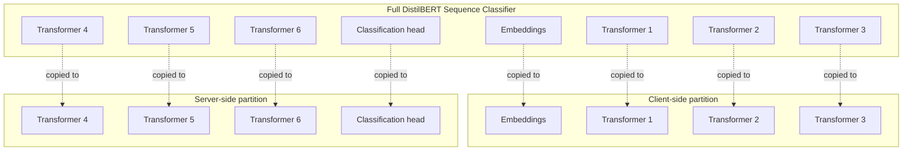
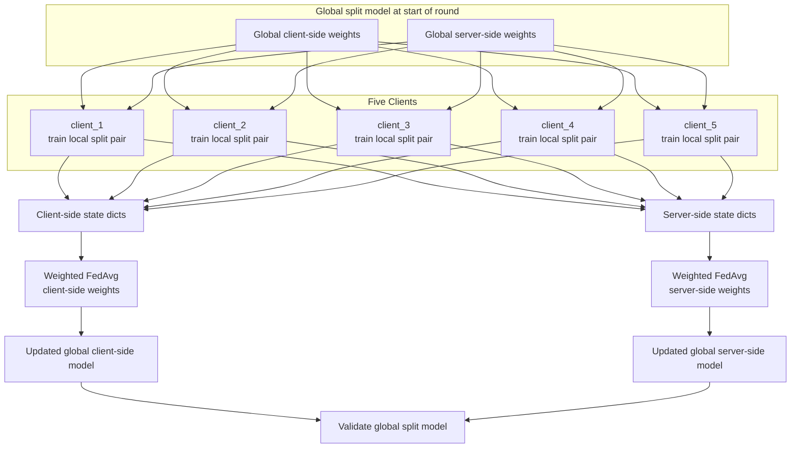
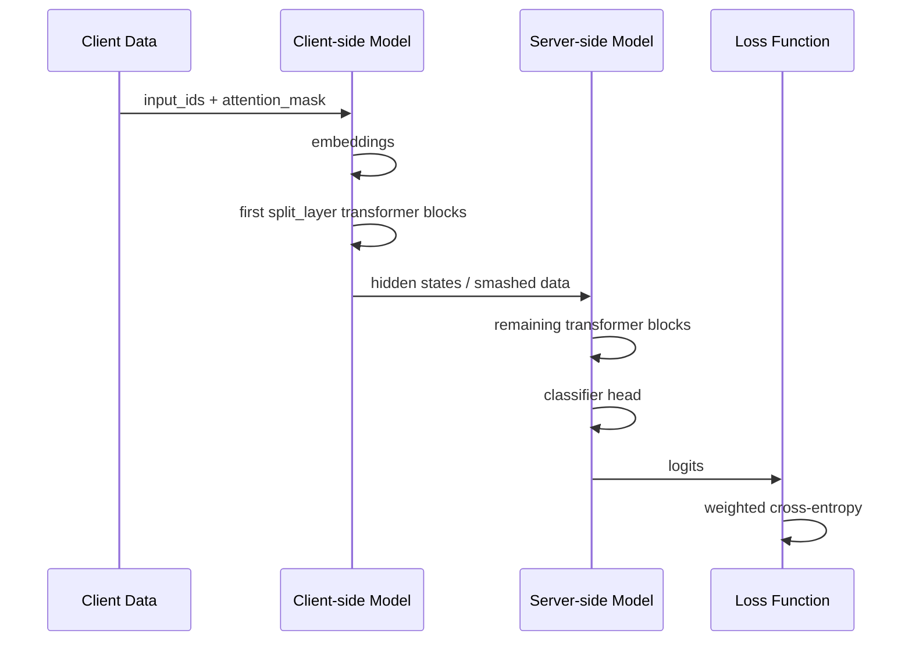
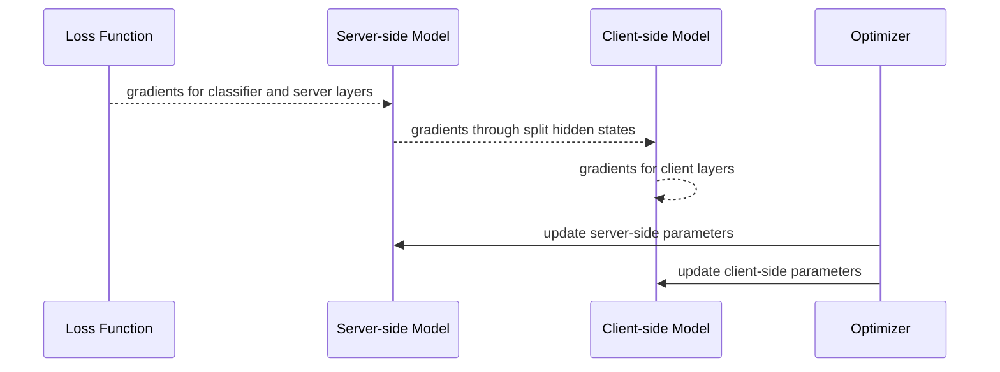
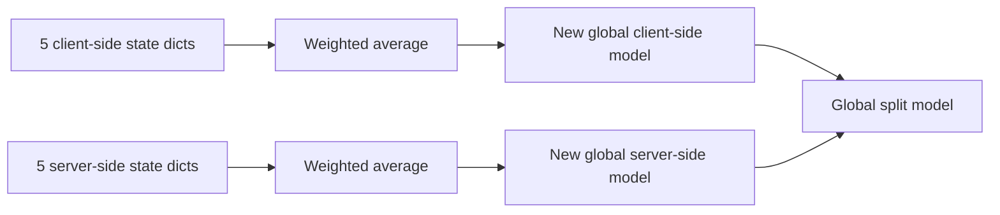
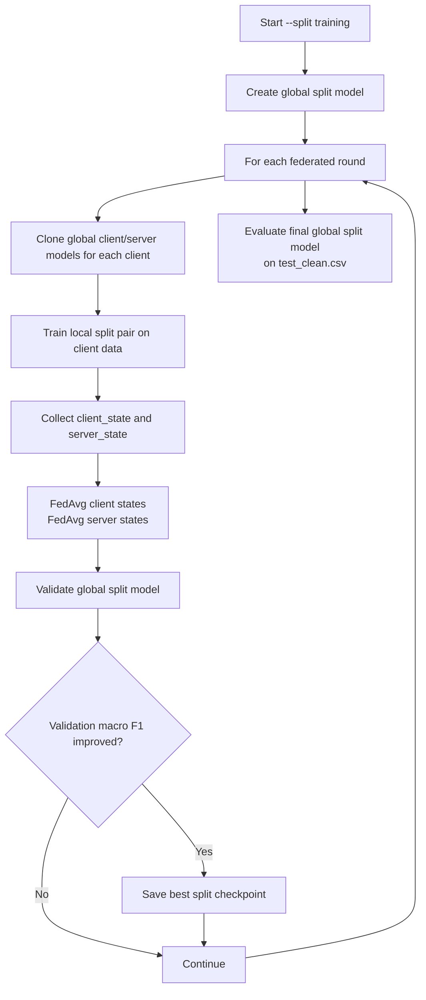

# Current Split Learning Architecture

This document describes the architecture currently implemented when running:

```bash
python src/train_fedlora.py --split --split_layer 3 ...
```

Important: in the current code, split learning does **not** use LoRA adapters.

```text
Current split mode = Split DistilBERT + FedAvg
Current split mode != Split LoRA
```

## One-Line Summary

The model is a full DistilBERT classifier split into two parts:

```text
Client side: embeddings + first N DistilBERT transformer layers
Server side: remaining DistilBERT layers + classification head
```

After each client trains locally, the server averages both:

```text
1. client-side model weights
2. server-side model weights
```

## Full Current Architecture

```mermaid
flowchart LR
  subgraph Client["Client Device / Client Simulation"]
    SMS["Raw SMS text"]
    TOK["Tokenizer\nDistilBERT tokenizer\nmax_len = 128"]
    IDS["input_ids\nattention_mask"]
    EMB["DistilBERT embeddings"]
    L1["Transformer layer 1"]
    L2["Transformer layer 2"]
    L3["Transformer layer 3\nif split_layer = 3"]
    H["Smashed data\nhidden states"]

    SMS --> TOK
    TOK --> IDS
    IDS --> EMB
    EMB --> L1
    L1 --> L2
    L2 --> L3
    L3 --> H
  end

  subgraph Server["Server-Side Model"]
    L4["Transformer layer 4"]
    L5["Transformer layer 5"]
    L6["Transformer layer 6"]
    CLS["CLS representation\nhidden[:, 0]"]
    PC["pre_classifier"]
    DROP["dropout"]
    HEAD["classifier\n3 output logits"]
    PRED["Prediction\nham | spam | smishing"]

    L4 --> L5
    L5 --> L6
    L6 --> CLS
    CLS --> PC
    PC --> DROP
    DROP --> HEAD
    HEAD --> PRED
  end

  H --> L4
```



For `--split_layer 3`, the first 3 transformer layers stay on the client side and the remaining 3 transformer layers stay on the server side.

## DistilBERT Layer Split



## Five-Client Training Round

In one federated round, all five clients start from the same global split model.



## Forward Pass During Local Split Training



## Backward Pass During Local Split Training



In this project, the split training is simulated on one machine/GPU, so the gradient transfer is conceptual rather than a real network call.

## What Is Updated?

Current split learning updates the full split DistilBERT model:

| Component | Location | Updated in split mode? |
|---|---|---|
| Embeddings | Client side | Yes |
| Early transformer layers | Client side | Yes |
| Later transformer layers | Server side | Yes |
| Pre-classifier | Server side | Yes |
| Classifier | Server side | Yes |
| LoRA adapters | Not used in split mode | No |

That is why the log shows something like:

```text
Split model params: 66,955,779 / 66,955,779 (100.00%)
```

It means all split model parameters are trainable.

## Aggregation Step

The current split mode uses `fedavg_state_dict()` twice:

```text
fedavg_state_dict(global_client_model, client_states, ...)
fedavg_state_dict(global_server_model, server_states, ...)
```

So aggregation happens separately for the two halves:



## Checkpoints

The final split model is saved to:

```text
models/split/{setting_name}/
```

The best validation checkpoint is saved to:

```text
models/split/{setting_name}_best/
```

Each split checkpoint contains:

```text
client_state.pt
server_state.pt
tokenizer files
```

## Current Split Mode vs FedLoRA

| Feature | FedLoRA mode | Current split mode |
|---|---|---|
| Command flag | no `--split` | `--split` |
| Model location | Full model on each client | Model divided into client/server |
| LoRA used? | Yes | No |
| Trainable parameters | LoRA adapter parameters | Full DistilBERT split parameters |
| Aggregated weights | LoRA adapter weights | Client-side and server-side state dicts |
| Main checkpoint folder | `models/fedlora/` | `models/split/` |

## Current Training Loop



## Practical Note

Because current split mode updates the full DistilBERT model, it is more sensitive than FedLoRA. A LoRA learning rate such as `2e-4` can be too high for split mode.

A safer split-learning starting command is:

```bash
python src/train_fedlora.py \
  --split --split_layer 1 \
  --rounds 5 \
  --local_epochs 1 \
  --lr 2e-5 \
  --clients_dir data/clients/setting_D_300 \
  --agg_weight total
```
