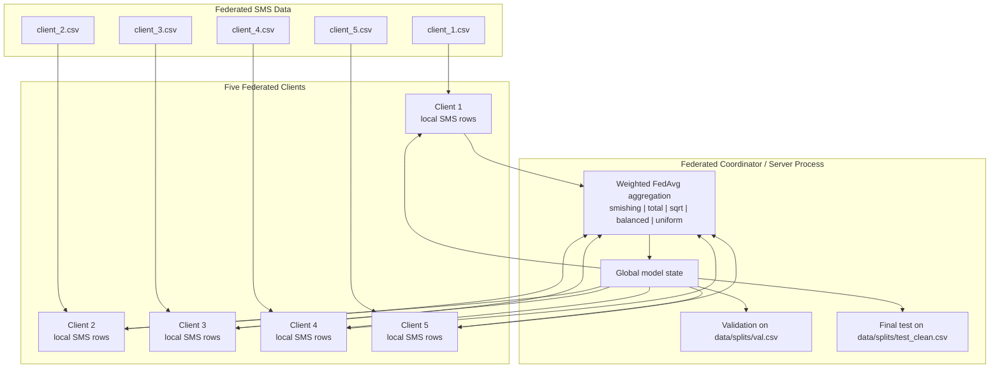
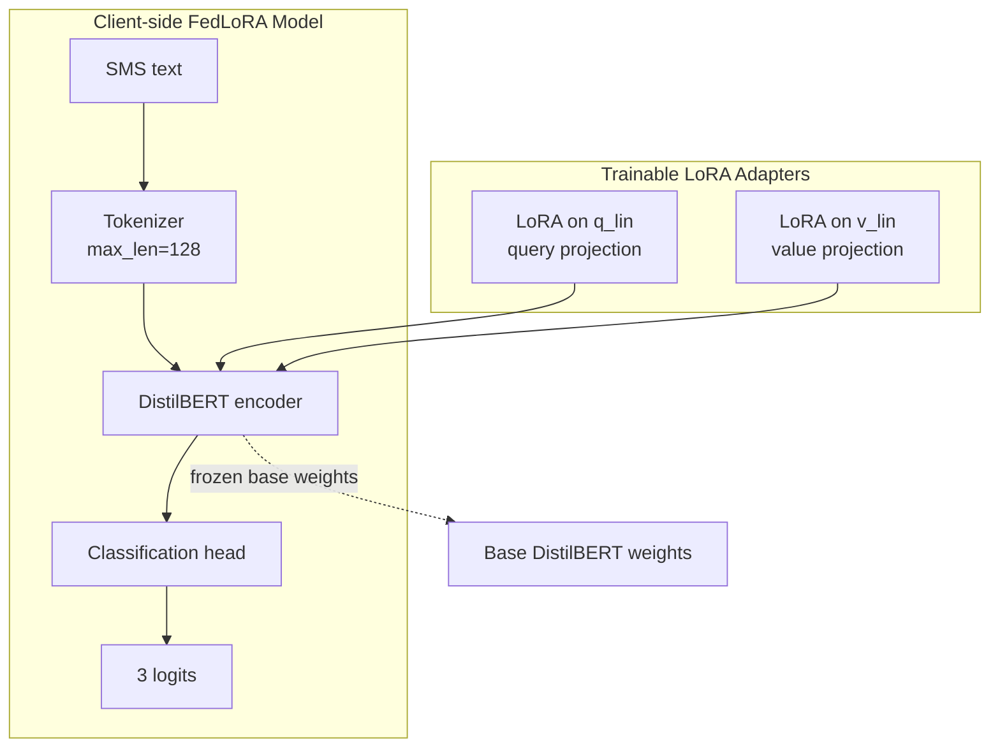
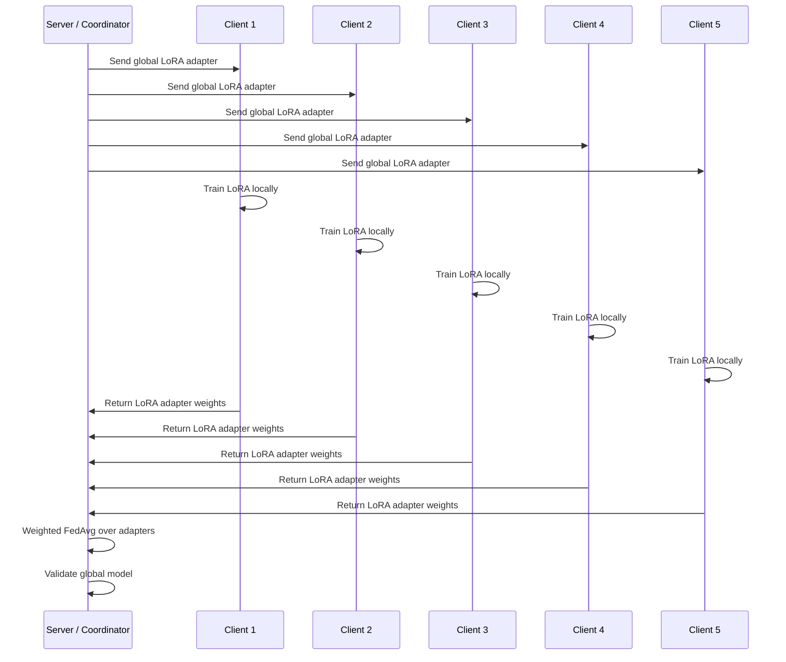
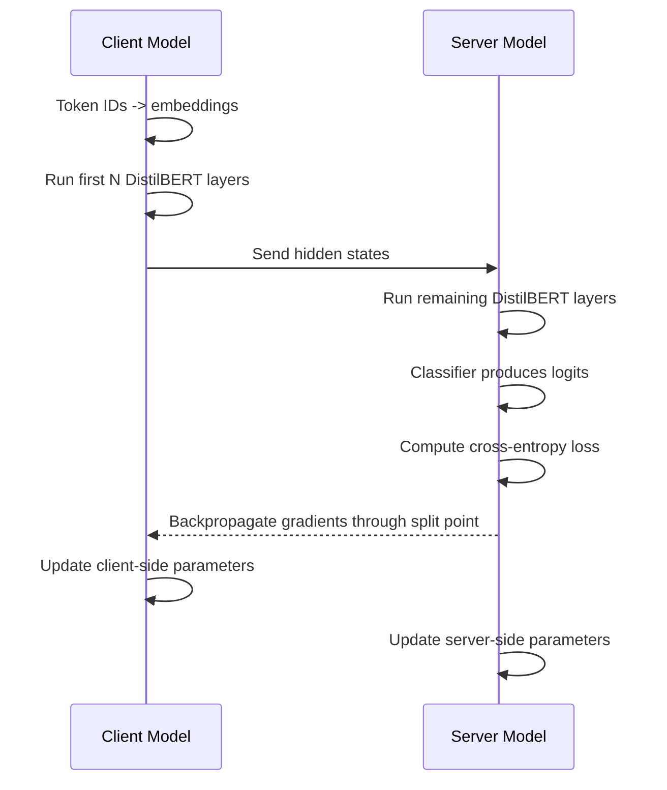
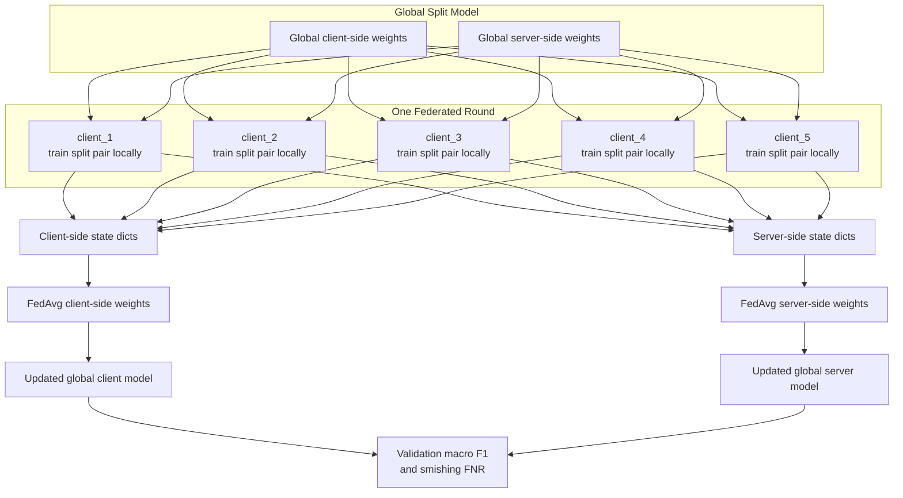
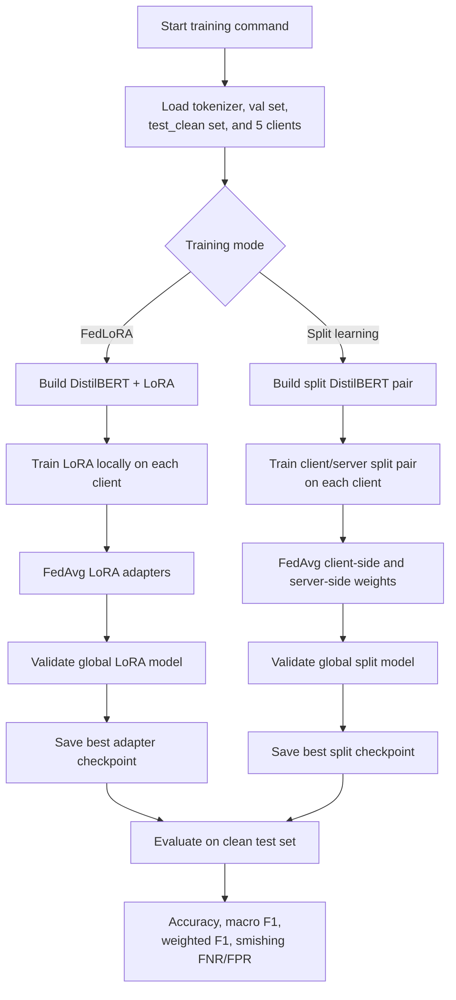

# Full Model Architecture: FedLoRA + Split Learning

This document shows the full architecture used in this project: five federated SMS clients, DistilBERT, LoRA adapters, split learning, server-side classification, aggregation, and evaluation.

The implementation is mainly in `src/train_fedlora.py`.

## High-Level System



Each client trains on its own CSV file. Raw SMS text stays inside the client simulation. The server/coordinator receives model updates, aggregates them, validates the global model, and saves checkpoints.

## Base DistilBERT Model

The base model is:

```text
distilbert-base-uncased
```

The classification task has 3 labels:

```text
ham      -> 0
spam     -> 1
smishing -> 2
```

DistilBERT contains:

```mermaid
flowchart LR
  I["input_ids + attention_mask"] --> E["Embeddings"]
  E --> L1["Transformer layer 1"]
  L1 --> L2["Transformer layer 2"]
  L2 --> L3["Transformer layer 3"]
  L3 --> L4["Transformer layer 4"]
  L4 --> L5["Transformer layer 5"]
  L5 --> L6["Transformer layer 6"]
  L6 --> CLS["[CLS] hidden state"]
  CLS --> PC["pre_classifier"]
  PC --> DO["dropout"]
  DO --> H["classifier head\n3 logits"]
  H --> Y["prediction:\nham | spam | smishing"]
```



## LoRA Architecture

Normal FedLoRA mode keeps the full DistilBERT model on each client, but only trains small LoRA adapter weights.

LoRA is applied to the DistilBERT attention projection layers:

```text
target_modules = ["q_lin", "v_lin"]
r = 8
lora_alpha = 16
lora_dropout = 0.1
```



In this mode, clients send only LoRA adapter weights to the server. The base DistilBERT weights remain fixed.

## FedLoRA Training Flow



## Split Learning Architecture

Split learning divides DistilBERT into two parts:

- **Client-side model**: embeddings + first `split_layer` transformer blocks
- **Server-side model**: remaining transformer blocks + classification head

With the common command:

```bash
python src/train_fedlora.py --split --split_layer 3 ...
```

the split is:

```text
Client side: embeddings + transformer layers 1, 2, 3
Server side: transformer layers 4, 5, 6 + classifier
```



```mermaid
flowchart LR
  subgraph ClientSide["Client Side"]
    X["Raw SMS text"] --> Tok["Tokenizer"]
    Tok --> IDs["input_ids\nattention_mask"]
    IDs --> Emb["DistilBERT embeddings"]
    Emb --> CLayer1["Transformer layer 1"]
    CLayer1 --> CLayer2["Transformer layer 2"]
    CLayer2 --> CLayer3["Transformer layer 3"]
    CLayer3 --> Smash["Smashed data\nhidden states"]
  end

  subgraph ServerSide["Server Side"]
    Smash --> SLayer4["Transformer layer 4"]
    SLayer4 --> SLayer5["Transformer layer 5"]
    SLayer5 --> SLayer6["Transformer layer 6"]
    SLayer6 --> CLS["Take hidden[:, 0]\nCLS token representation"]
    CLS --> PC["pre_classifier"]
    PC --> Drop["dropout"]
    Drop --> Head["classifier"]
    Head --> Logits["3 logits"]
  end

  Logits --> Loss["Cross entropy loss\nwith class weights"]
```

## Split Learning Forward and Backward Pass



In this repository, split learning is simulated on one machine/GPU. The code still keeps the architectural separation between the client model and server model.

## Five-Client Split-Fed Architecture

In split federated mode, each client receives a copy of the global client/server split model pair. After local split training, both sides are aggregated.



## Aggregation

The same weighting options are available for FedLoRA and split-fed training:

| Option | Meaning |
|---|---|
| `smishing` | Weight each client by its number of smishing samples |
| `total` | Weight each client by total number of samples |
| `sqrt` | Weight each client by square root of smishing count |
| `balanced` | Average of total-sample and smishing-sample weighting |
| `uniform` | Equal client weight |

For FedLoRA, aggregation averages LoRA adapter weights.

For split learning, aggregation averages:

```text
1. client-side model state dicts
2. server-side model state dicts
```

## Checkpoints and Outputs

FedLoRA adapter checkpoints:

```text
models/fedlora/global_adapter_{setting_name}/
models/fedlora/global_adapter_{setting_name}_best/
```

Split learning checkpoints:

```text
models/split/{setting_name}/
models/split/{setting_name}_best/
```

Split checkpoints contain:

```text
client_state.pt
server_state.pt
tokenizer files
```

Result files:

```text
reports/results_fedlora_rounds.csv
reports/results_split_final.csv
reports/RESULTS.md
reports/figures/confusion_matrix_split_final.png
```

## End-to-End Training Summary



## Important Tuning Note

FedLoRA trains only a small number of adapter parameters, so a learning rate like `2e-4` can be reasonable.

Split learning in this implementation trains the full split DistilBERT model, so the trainable parameter count is much larger. For split learning, start with a smaller learning rate:

```bash
python src/train_fedlora.py \
  --split --split_layer 1 --rounds 5 --local_epochs 1 --lr 2e-5 \
  --clients_dir data/clients/setting_D_300 \
  --agg_weight total
```

Then increase rounds only if validation macro F1 remains stable.
