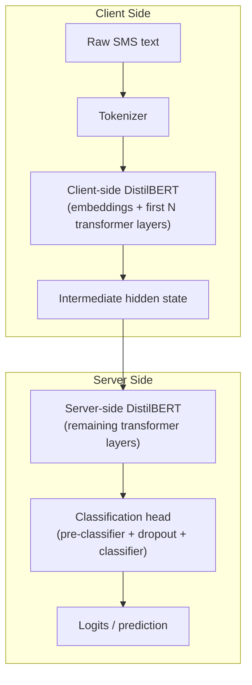
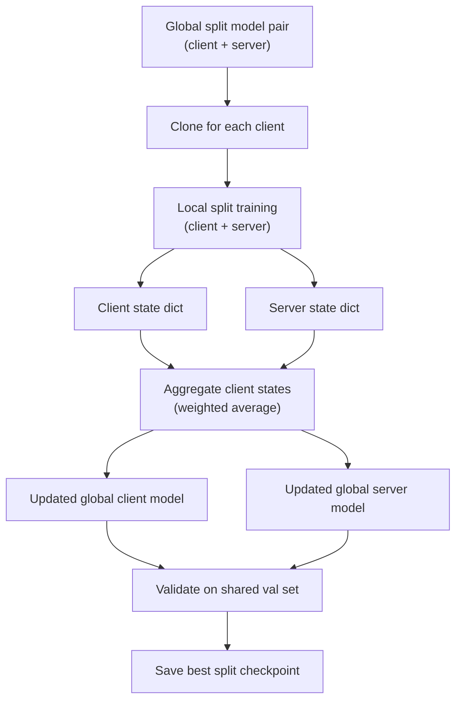

# Split Learning in FedLoRA Split Learning Project

This document explains how split learning is implemented in this repository, using `src/train_fedlora.py`.
It is written for a reader who knows the basics of machine learning and wants to understand how the code implements a split client-server model.

## What is split learning here?

Split learning is a training paradigm where the neural network is split into two parts:

- **Client-side model**: processes raw input data and computes intermediate features.
- **Server-side model**: receives those intermediate features and finishes the forward pass for classification.

In this repository, the split is applied to DistilBERT.
The client keeps the embedding layer and the first `N` transformer layers.
The server keeps the remaining transformer layers and the classification head.

This approach reduces the amount of raw data processed on the server side and simulates a privacy-preserving client/server setup.

## Where the implementation lives

The split learning implementation is contained entirely in `src/train_fedlora.py`.

### Architecture diagram



### Training flow diagram



Key components:

- `SplitDistilBertClient` — client-side model partition
- `SplitDistilBertServer` — server-side model partition
- `make_split_models()` — builds both sides from a base DistilBERT model
- `local_split_train()` — trains a client/server pair locally
- `evaluate_split()` — evaluates a split model pair
- `save_split_checkpoint()` / `load_split_checkpoint()` — save and restore split models

## How the split is defined

A split is defined by `--split_layer`, which defaults to `3`.
This means the first 3 transformer layers of DistilBERT stay on the client side, and the remaining layers move to the server.

### Client-side model (`SplitDistilBertClient`)

The client model contains:

- `embeddings`
- first `split_layer` transformer blocks

During forward pass:

1. The input tokens are embedded.
2. The embeddings are passed sequentially through the client transformer layers.
3. The output hidden states are returned as the intermediate representation.

### Server-side model (`SplitDistilBertServer`)

The server model contains:

- remaining DistilBERT transformer blocks
- `pre_classifier`
- `dropout`
- `classifier`

During forward pass:

1. The server receives the client hidden state.
2. It processes that hidden state through the remaining transformer layers.
3. It applies the classification head to produce logits.

## Training in split mode

Split learning is activated with the CLI flag `--split`.

There are two modes:

- `--local --split`: local-only split training, one split model per client, no aggregation.
- `--split` only: federated split learning, where a global split model is aggregated across clients.

### Local split training

When run with `--local --split`, the script:

1. Creates a fresh split client/server model for each client.
2. Loads global client/server weights if `--resume` is provided.
3. Trains the split pair locally on the client data.
4. Evaluates the trained split model on the global test set.
5. Saves the local split checkpoint under `models/split/{client_id}_local_split/`.

### Federated split training

When run with `--split` and without `--local`, the script simulates federated split learning:

1. Build or resume a global split model pair:
   - `global_client_model`
   - `global_server_model`
2. For each client:
   - Clone the global split model pair.
   - Train the client/server pair locally on client data.
   - Save the client-side and server-side state dictionaries.
3. Aggregate the client-side states across clients and update `global_client_model`.
4. Aggregate the server-side states across clients and update `global_server_model`.
5. Validate the aggregated global split model on the shared validation set.
6. Save the best split checkpoint under `models/split/{setting_name}_best/`.

The aggregation logic is shared with the federated LoRA implementation, using weighted averaging over state dictionaries.
By default, the aggregation uses `--agg_weight smishing`, so clients with more smishing samples contribute more.

## Key training helper functions

### `make_split_models(split_layer)`

This helper builds a fresh client/server pair from a pre-trained DistilBERT model.
It loads the base DistilBERT model and splits it at the chosen layer.

### `local_split_train(client_model, server_model, loader, device, class_weights, n_epochs, lr)`

This function trains both the client and server model together:

- Uses cross-entropy loss with class weights.
- Optimizes all trainable parameters from both sides.
- Applies gradient clipping and a linear warmup scheduler.

Because the client and server are both on the same GPU during simulation, this is a simplified split learning implementation.

### `evaluate_split(client_model, server_model, loader, device)`

This function evaluates a split model pair by performing a forward pass through the client first,
then the server, and collecting predictions.

## Checkpoint format

Split checkpoints are saved as:

- `client_state.pt` — client model weights
- `server_state.pt` — server model weights
- tokenizer files from HuggingFace

This is handled by `save_split_checkpoint()`.

## How to run split learning

Example command for federated split learning:

```bash
.venv/bin/python src/train_fedlora.py \
  --split --split_layer 3 --rounds 10 --local_epochs 2 --lr 2e-4 \
  --clients_dir data/clients/setting_D_300 \
  --agg_weight smishing
```

Example command for local-only split training:

```bash
.venv/bin/python src/train_fedlora.py \
  --local --split --split_layer 3 --local_epochs 10 --lr 2e-4 \
  --clients_dir data/clients/setting_D_300
```

## What this implementation is not

- It does not simulate real network communication between client and server.
- It does not implement privacy-preserving encrypted gradients or secure aggregation.
- It uses a shared device to simulate split training, so the privacy guarantee is conceptual rather than cryptographic.

## Why this is useful

This implementation is useful for:

- understanding the split learning partitioning of a transformer model,
- comparing split learning to federated LoRA in the same codebase,
- experimenting with how much of DistilBERT can remain on the client (`--split_layer`).

## File references

- `src/train_fedlora.py` — main split learning implementation and CLI
- `src/evaluate.py` — shared evaluation metrics
- `src/utils.py` — data loading, device selection, result saving

If you want, I can also add a short architecture diagram to this document.