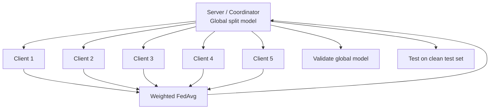
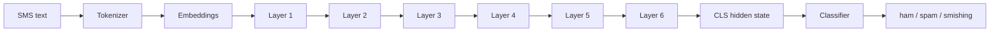
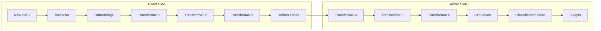
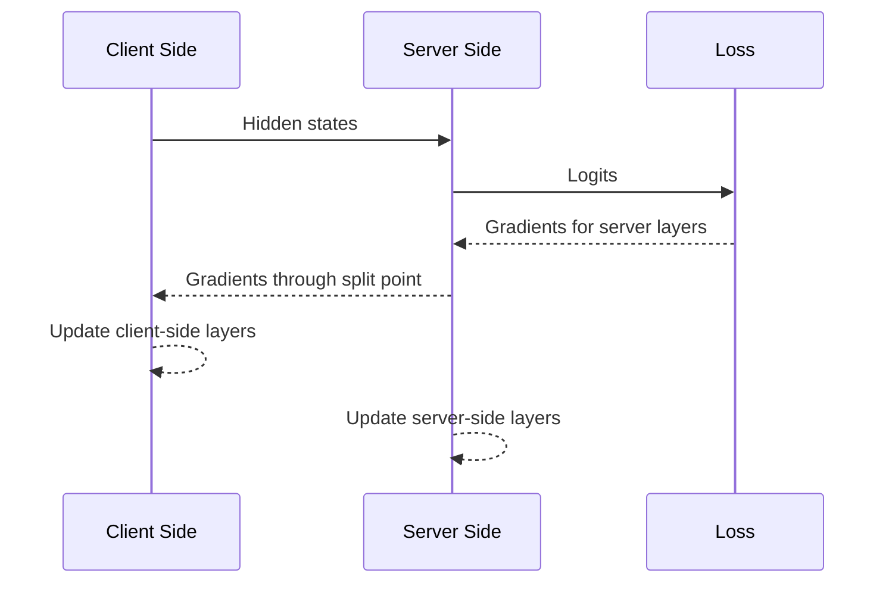
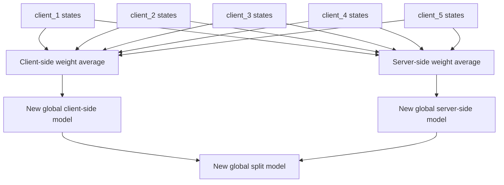

# Presentation: Current Split Learning Model Architecture

Use this file as a slide-by-slide speaking guide for explaining the current split learning architecture in this project.

The key message:

```text
This model is a Split DistilBERT federated learning system.
It is not Split LoRA.
```

---

## Slide 1: Title

# Split Learning Architecture for Smishing Detection

**Project:** FedSmishGuard  
**Task:** SMS classification into ham, spam, and smishing  
**Model:** DistilBERT split between client and server  
**Federation:** Five clients with weighted FedAvg

Speaker notes:

Introduce the model as a privacy-aware learning setup for SMS smishing detection. The goal is to train across multiple clients without centralizing raw SMS messages.

---

## Slide 2: Problem Motivation

## Why This Architecture?

- SMS phishing data can be sensitive.
- Centralized training requires collecting all messages in one place.
- Federated learning keeps each client's raw data local.
- Split learning separates the model into client-side and server-side parts.
- The server sees intermediate hidden states instead of raw SMS text.

Speaker notes:

Explain that the project combines two ideas: federated training across clients and split learning inside each local training process. The main privacy idea is that raw SMS text remains on the client side.

---

## Slide 3: Dataset and Labels

## Classification Task

The model predicts one of three labels:

```text
ham      -> normal message
spam     -> unwanted promotional message
smishing -> phishing/scam SMS
```

Five clients are used:

```text
client_1
client_2
client_3
client_4
client_5
```

Speaker notes:

Mention that each client has its own local CSV file. The clients are non-IID, meaning each client can have a different class distribution.

---

## Slide 4: Base Model

## Base Model: DistilBERT

The starting model is:

```text
distilbert-base-uncased
```

It is loaded as:

```text
DistilBertForSequenceClassification
```

The classification head is adapted for:

```text
3 output classes
```

Speaker notes:

DistilBERT is a smaller, faster version of BERT. It has 6 transformer layers. In this project, it is used as a sequence classifier for SMS messages.

---

## Slide 5: Important Clarification

## This Split Mode Does Not Use LoRA

There are two modes in the codebase:

| Mode | Uses LoRA? | Uses split learning? |
|---|---:|---:|
| FedLoRA mode | Yes | No |
| Current `--split` mode | No | Yes |

Current split mode:

```text
Split DistilBERT + FedAvg
```

Not:

```text
Split LoRA
```

Speaker notes:

This is important because the file is named `train_fedlora.py`, but when `--split` is used, the code builds a plain DistilBERT sequence classifier and splits it. It does not insert LoRA adapters into the split model.

---

## Slide 6: Overall System Diagram

## Five-Client Federated Setup



Speaker notes:

The server starts with a global model. Each client trains a local copy. After local training, the server aggregates model weights and creates a new global model.

---

## Slide 7: DistilBERT Before Splitting

## Full DistilBERT Classifier



Speaker notes:

Before splitting, DistilBERT processes tokenized SMS text through embeddings and 6 transformer layers, then uses the CLS representation for classification.

---

## Slide 8: Split Point

## Split at `split_layer = 3`

With:

```bash
--split_layer 3
```

the model is divided like this:

| Side | Components |
|---|---|
| Client | Embeddings + layers 1, 2, 3 |
| Server | Layers 4, 5, 6 + classifier |

Speaker notes:

The split layer controls how much of DistilBERT stays on the client. With split layer 3, the client does the first half of the encoder, and the server completes the second half.

---

## Slide 9: Current Split Architecture

## Client and Server Model Parts



Speaker notes:

The client sends hidden states, sometimes called smashed data, to the server model. The server produces logits for the three classes.

---

## Slide 10: Forward Pass

## How One Batch Moves Through the Model

```text
SMS text
-> tokenizer
-> client-side DistilBERT layers
-> hidden states
-> server-side DistilBERT layers
-> classifier
-> logits
-> loss
```

Speaker notes:

This is the forward pass. The raw input starts on the client side. The server receives hidden states rather than raw text.

---

## Slide 11: Backward Pass

## How Learning Happens



Speaker notes:

During backpropagation, the loss is computed on the server side. Gradients flow backward through the server model and then through the split point to update the client-side model.

---

## Slide 12: Local Client Training

## What Happens on Each Client?

Each client trains a local split model pair:

```text
client_model + server_model
```

The optimizer updates:

```text
client-side DistilBERT parameters
server-side DistilBERT parameters
classification head parameters
```

Speaker notes:

In the current implementation, both the client-side and server-side parts are trained together during local training. This is simulated on one GPU, but architecturally the model is separated.

---

## Slide 13: Federated Aggregation

## What Is Sent Back to the Server?

After local training, each client returns:

```text
client-side state dict
server-side state dict
```

The server aggregates them separately:

```text
average all client-side weights
average all server-side weights
```

Speaker notes:

This is different from FedLoRA. FedLoRA only sends adapter weights. Current split learning sends and averages full state dictionaries for both sides of the split model.

---

## Slide 14: Aggregation Diagram

## Split-Fed Weight Averaging



Speaker notes:

The final global model for the next round is made from two aggregated parts: the averaged client-side model and the averaged server-side model.

---

## Slide 15: Training Round

## One Federated Round

```text
1. Server provides global split model.
2. Each client receives a copy.
3. Each client trains locally.
4. Each client returns trained client/server weights.
5. Server aggregates weights using FedAvg.
6. Server evaluates global validation macro F1.
7. Best checkpoint is saved if validation improves.
```

Speaker notes:

This cycle repeats for the number of communication rounds specified by `--rounds`.

---

## Slide 16: Metrics

## What Metrics Matter?

The most important metrics are:

```text
global macro F1
smishing FNR
accuracy
```

Macro F1:

```text
(F1_ham + F1_spam + F1_smishing) / 3
```

Speaker notes:

Macro F1 is important because the classes are imbalanced. Accuracy alone can hide poor smishing detection. Smishing FNR is also important because it measures how often smishing messages are missed.

---

## Slide 17: Why Performance Can Drop

## Why Split Mode Can Be Unstable

Current split mode trains all DistilBERT parameters:

```text
Split model params: 66,955,779 / 66,955,779
```

This is much larger than LoRA training.

Common causes of low score:

- learning rate too high
- too many local epochs
- non-IID client drift
- unstable aggregation after good rounds

Speaker notes:

This explains why a LoRA learning rate such as `2e-4` can work for FedLoRA but be too high for split learning. Split mode is full fine-tuning.

---

## Slide 18: Best Checkpoint

## Use the Best Validation Round

The script saves the best validation checkpoint:

```text
models/split/{setting_name}_best/
```

If round 8 has macro F1 `0.70` and round 10 drops to `0.22`, the round 8 checkpoint is better.

Speaker notes:

Explain that final round is not always best. In federated training, later rounds can overfit or drift. Validation macro F1 should decide the selected model.

---

## Slide 19: Safer Tuning Setup

## Recommended Split Learning Command

```bash
python src/train_fedlora.py \
  --split \
  --split_layer 1 \
  --rounds 5 \
  --local_epochs 1 \
  --lr 2e-5 \
  --clients_dir data/clients/setting_D_300 \
  --agg_weight total
```

Speaker notes:

This command is safer because it uses a smaller learning rate, fewer local epochs, and a smaller client-side split. It can reduce client drift.

---

## Slide 20: Final Summary

## Summary

- The current split model uses `distilbert-base-uncased`.
- The model is divided into client-side and server-side parts.
- Five clients train local split model pairs.
- The server aggregates client-side and server-side weights separately.
- LoRA is not used in current split mode.
- Macro F1 and smishing FNR are the key metrics.
- Best validation checkpoint should be used for final reporting.

Speaker notes:

Close by emphasizing the main architecture: Split DistilBERT + FedAvg over five clients. If asked about LoRA, clarify that LoRA belongs to the non-split FedLoRA mode, not the current split-learning mode.

---

## Backup Slide: Code Mapping

## Where This Happens in Code

| Concept | Code |
|---|---|
| Build split model | `make_split_models()` |
| Client-side model | `SplitDistilBertClient` |
| Server-side model | `SplitDistilBertServer` |
| Local split training | `local_split_train()` |
| Split evaluation | `evaluate_split()` |
| Aggregation | `fedavg_state_dict()` |
| Best checkpoint | `save_split_checkpoint()` |

Speaker notes:

Use this if someone asks how the diagram maps to the actual implementation.

---

## Backup Slide: Main Correction

## Common Misunderstanding

Because the file is named:

```text
train_fedlora.py
```

it may look like split mode also uses LoRA.

But the current split code calls:

```text
AutoModelForSequenceClassification.from_pretrained("distilbert-base-uncased")
```

and then copies normal DistilBERT layers into:

```text
SplitDistilBertClient
SplitDistilBertServer
```

So current split mode is:

```text
Split DistilBERT, not Split LoRA
```
